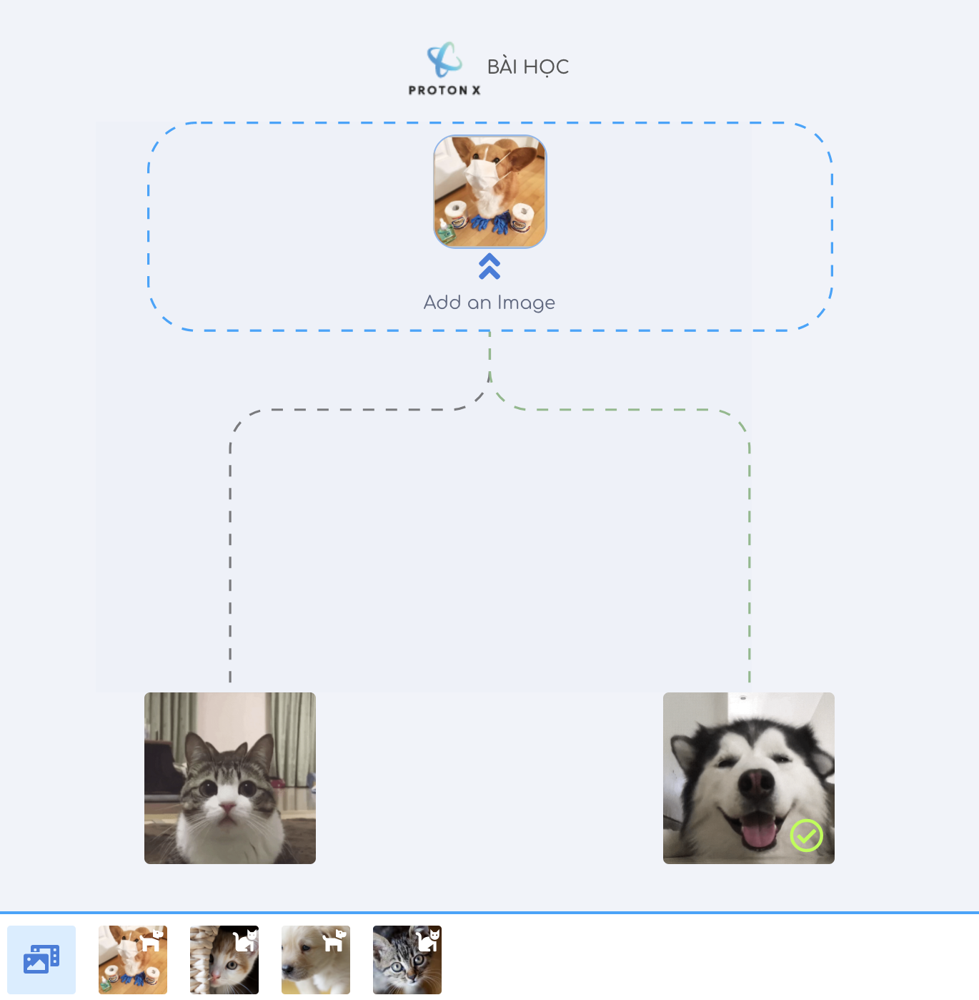

### Mục lục
----
- <a href="./math">1. Kiến thức toán học cần thiết</a> (Hoàn tất)
- <a href="./python-tutorials">2. Kỹ năng lập trình Python</a> (Hoàn tất)
- <a href="./numpy">3. Thư viện Numpy và TensorFlow</a> (Hoàn tất)
- <a href="./visualize">4. Hiển thị dữ liệu và các công cụ</a> (Đang tiến hành)
    - [Dữ liệu bảng](./visualize/pandas)
- <a href="./models/linear-regression/">5. Bài toán hồi quy (Regression)</a> (Hoàn tất)
- <a href="./models/logistic-regression">6. Bài toán phân loại (Classification)</a> (Hoàn tất)
- <a href="./deployment/distributed-tensorflow">7. Triển khai (Deploy) Machine Learning Model trên Production</a> (Hoàn tất)
- <a href="./deployment/tensorflow-browser">8. Machine Learning trên trình duyệt và TensorFlowJS</a> (Hoàn tất)
- <a href="./tf2.0">9. Cập nhật mới nhất</a>
    - [TensorFlow 2.0](https://github.com/bangoc123/learn-machine-learning-in-two-months/tree/master/tf2.0)
    - [Trải nghiệm PaperSpace Gradient Community](https://github.com/bangoc123/learn-machine-learning-in-two-months/tree/master/articles/GradientPaperSpace.MD)
- <a href="./algorithms">10. Ôn luyện thuật toán mỗi ngày</a> (Đang tiến hành)
    - [Backtracking Algorithm](./algorithms/graph/backtracking/backtracking.MD)
- <a href="./algorithms">11. Một số ứng dụng triển khai thực tế</a> (Đang tiến hành)
    - [Ứng dụng Transfer Learning](https://protonx.app/transfer-learning)

      